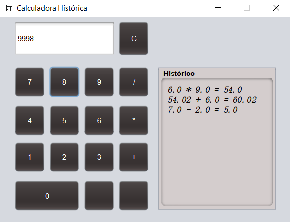
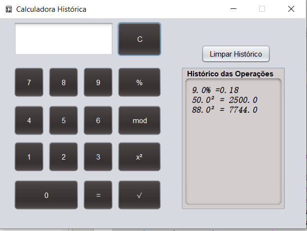

# 🧮 Calculadora com Histórico

Projeto Java criado com *Swing* no *NetBeans IDE 13*, com interface gráfica (JFrame), botões personalizados e exibição de histórico de cálculos realizados.

Este repositório contém duas versões distintas da calculadora, ambas funcionais e úteis para estudos de lógica de programação e interface gráfica em Java.

---

## ✨ Interfaces Disponíveis

### 🟢 Versão Principal (main)
A versão disponível na branch principal (main) realiza operações básicas de forma eficiente, com histórico automático e layout responsivo.

---

### 🧪 Versão com Operações Avançadas (feature-operacoes-avancadas)
Essa versão estende a calculadora com as seguintes funcionalidades extras:

- Exponenciação (x²)
- Raiz quadrada (√)
- Porcentagem (%)
- Módulo (mod)
- Botão exclusivo para limpar apenas o histórico

> ⚠️ Esta versão encontra-se em uma branch separada e não está integrada à main.

---

## ▶️ Como executar o projeto

Certifique-se de ter o *Git* instalado.

Clone o repositório com o comando:

bash
git clone https://github.com/bravoodev/CalculadoraHist.git

Abra o projeto no *NetBeans IDE 13*, compile e execute.

---

## ⚙️ Funcionalidades

### Versão principal (main)
- Realiza operações básicas: adição, subtração, multiplicação e divisão
- Interface gráfica com botões personalizados
- Histórico automático dos cálculos realizados
- Layout responsivo fixo com campo de visor e rolagem para histórico

### Versão avançada (feature-operacoes-avancadas)
- Todas as funcionalidades da versão principal
- Exponenciação, raiz quadrada, porcentagem e módulo
- Botão para limpar o histórico separadamente

---

## 💻 Tecnologias Utilizadas
- Java (JDK 17+)
- Swing (javax.swing)
- NetBeans IDE 13
- Git & GitHub

---

## 📁 Organização

Este projeto está organizado em múltiplas branches para facilitar o versionamento e a comparação de funcionalidades.

---

Desenvolvido por Lucas Bravo
GitHub - @bravoodev

